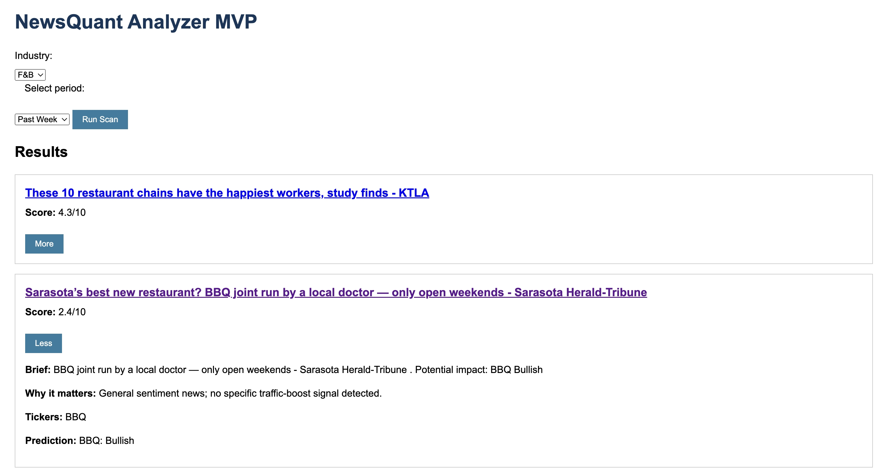

# NewsQuant – Traffic-Boost News Analyzer 🚀

[](https://www.python.org/) [](https://fastapi.tiangolo.com/) [](LICENSE)

A lightweight web application that automatically collects recent business news, detects *traffic-boost* signals (management changes, tech investments, LTOs, partnerships, social buzz, etc.), and ranks articles by relevance and predicted stock impact.

Created as an end-to-end **MVP** to showcase product sense, backend chops, and pragmatic NLP on a shoestring – no paid APIs, no keys, just Python ♥.

---

## ✨ Key Features

| ✨ | Feature |
|---|---|
| 🔍 | **RSS Crawler** (Google News) with industry filter & time window (day / week / month) |
| 🧠 | **NLP Pipeline** – sentiment (VADER), ticker extraction (regex), traffic-boost keyword detection |
| 🤖 | **LLM Summaries** – *t5-small* generates a concise “Brief” + potential impact line |
| 🏅 | **Relevancy Score** (0-10) combines traffic-boost signals, sentiment strength, and ticker presence |
| ⚡ | **FastAPI** backend, single-file static frontend (vanilla JS) – no build step |
| 🖱 | **Progressive Reveal UI** – titles & scores load instantly, click **More** to view details |

---

## 🖥️ Application Preview

### Main Page



## 🏗️ Architecture

```
┌────────────┐   RSS (HTTP)   ┌────────────────┐
│ news_fetch │──────────────▶│  feedparser     │
└────────────┘                └────────────────┘
       │                                    │
       ▼                                    ▼
┌────────────┐        NLP         ┌────────────────┐
│ summarizer │◀──────────────────│  news_analyzer  │
└────────────┘                    └────────────────┘
       │                                    │
       ▼                                    ▼
               FastAPI  →  JSON  →  Vanilla JS UI
```

---

## 🚀 Quick Start

```bash
# 1. Clone
$ git clone https://github.com/DauletKaparov/NewsQuant.git && cd NewsQuant

# 2. Install deps (CPU-only)
$ pip install --extra-index-url https://download.pytorch.org/whl/cpu -r requirements.txt

# 3. Run
$ uvicorn app.main:app --reload

# 4. Open
Visit http://127.0.0.1:8000 – select industry & period, click “Run Scan”.
```

> 💡 **Tip:** First launch downloads the `t5-small` model (~240 MB). Subsequent runs start instantly.

---

## 📝 Project Structure

```
NewsQuant/
├── app/                 # FastAPI backend
│   ├── api/             # Routes: /scan, /articles
│   ├── models/          # Pydantic schemas
│   ├── services/        # Crawler, NLP, summarizer
│   └── static/          # index.html + main.js
├── tests/               # (placeholder) PyTest suites
├── requirements.txt
└── README.md
```

---

## 🛠 Tech Stack

* Python 3.12, FastAPI, Uvicorn ⎯ backend & static hosting
* `feedparser` – RSS ingestion (no API keys!)
* NLP: **VADER** sentiment, regex ticker extraction, keyword traffic-boost detector
* Summaries: `t5-small` via 🤗 Transformers (CPU)
* Frontend: plain **HTML + ES6** – minimal & deploy-anywhere

---

## 💡 Future Work

* Better ticker extraction (spaCy NER)
* Vector DB or Elasticsearch for historical search
* Dockerfile & GitHub Actions CI
* Unit tests & coverage badge

---

## 📄 License

This project is licensed under the [MIT License](LICENSE).
